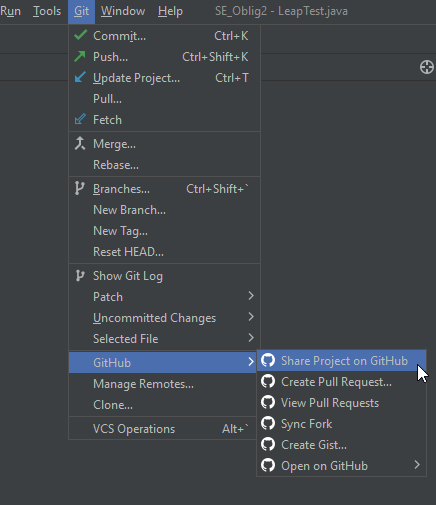
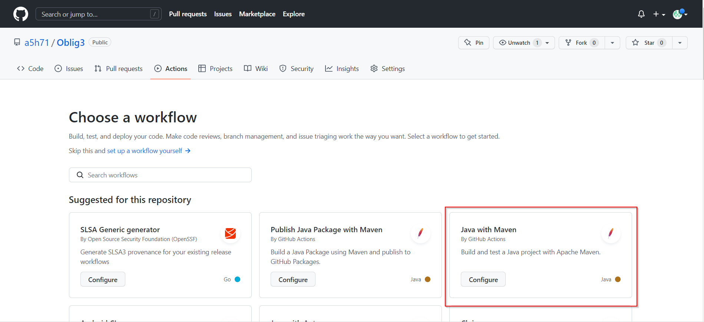
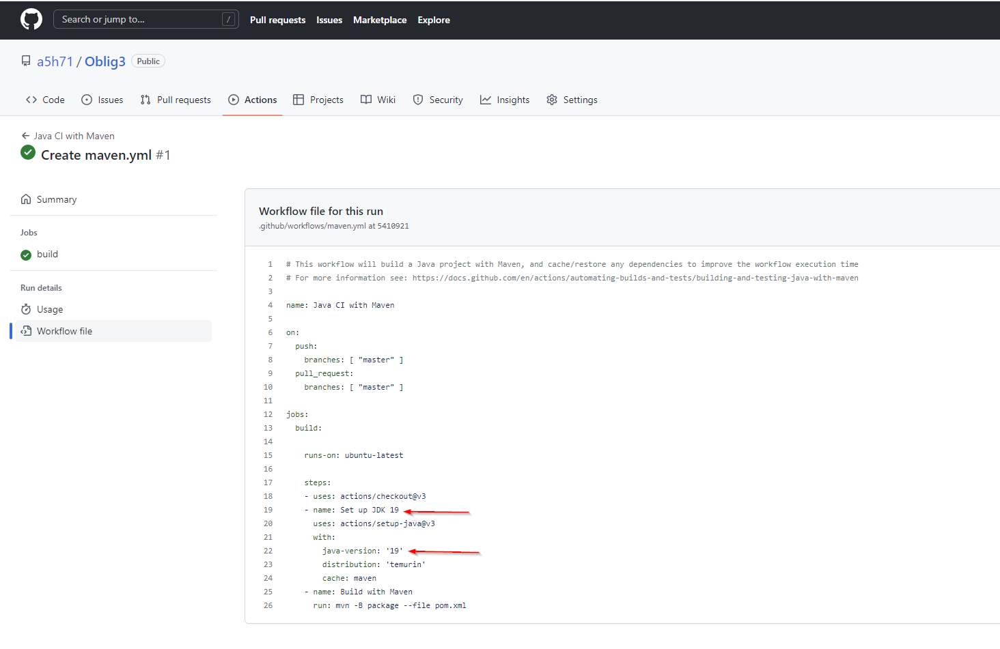
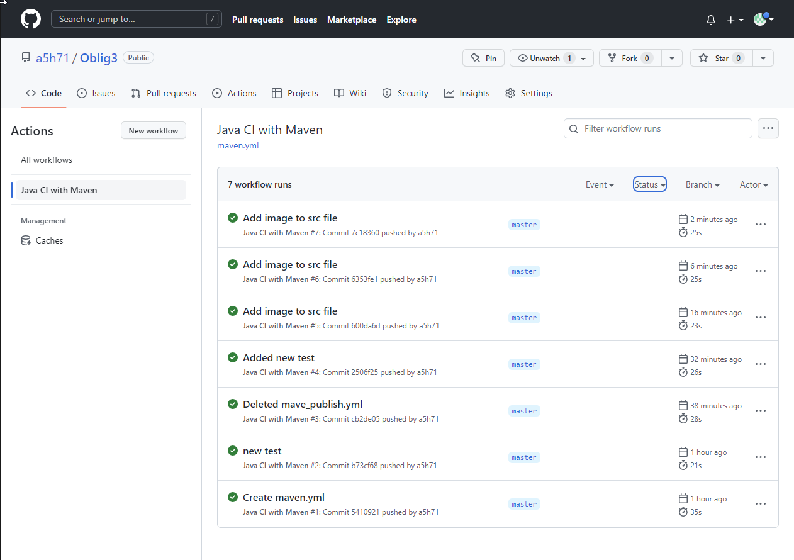

# Oblig3

### Github Actions setup:

>__Step 1__: Upload project through InelliJ 

>__Step 2__: Click on Actions button and choose 

>__Step 3__: Change the JDK in the mave.yml file

>__Step 4__: Add new commits and push to the repository. Everytime a new commit comes it is run. If it passes all the tests it will be green.

