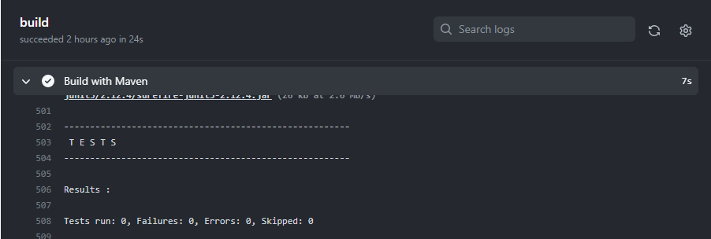
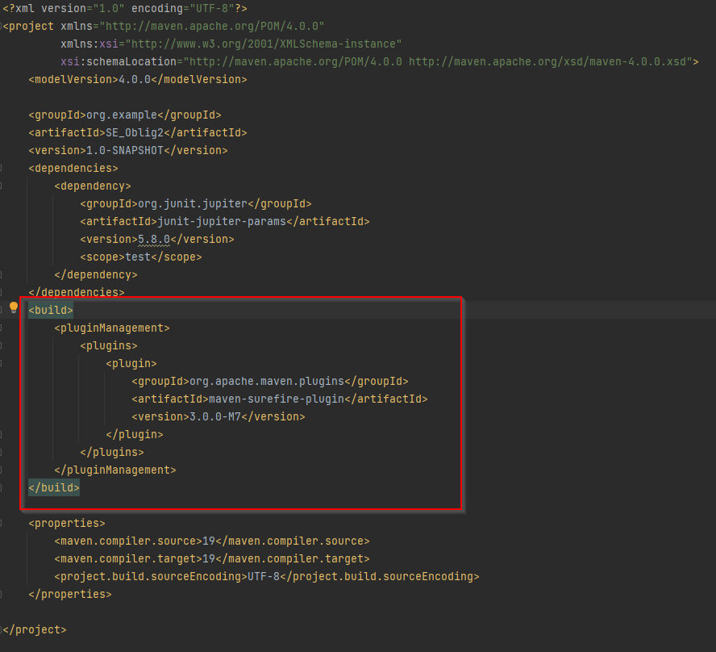
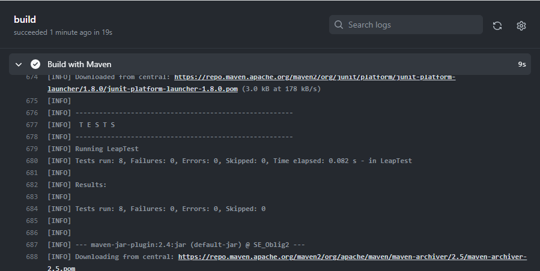

# Oblig3

### Github Actions setup:

>__Step 1__: Upload project through InelliJ 

>__Step 2__: Click on Actions button and choose 

>__Step 3__: Change the JDK in the mave.yml file

>__Step 4__: Under the Actions tab, the logs of the build will show. 

>Although everything was building without issues, I noticed the tests weren't running once I clicked the build.

>__Step 5__: To automate testing, added the following to the pom.xml file

> All the tests are running now after a new commit

